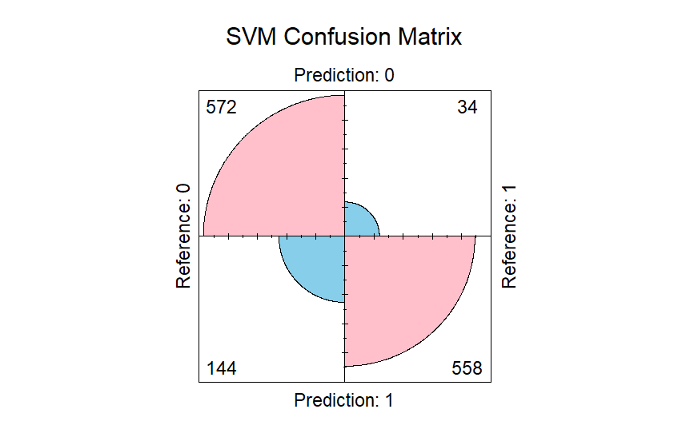
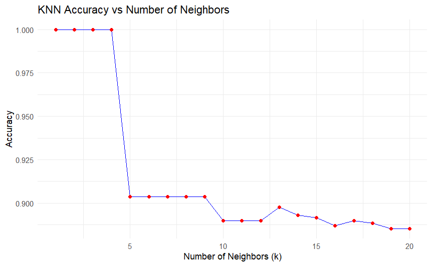

# Credit Card Approval Classification

This project applies **Support Vector Machines (SVM)** and **k-Nearest Neighbors (KNN)** to predict credit card approval decisions based on anonymized application data. The dataset is derived from the [UCI Credit Approval Dataset](https://archive.ics.uci.edu/ml/datasets/Credit+Approval), simplified to include only numeric features.

---

## 🔍 Problem
Credit approval decisions are critical for financial institutions. The goal is to classify whether an application should be **approved (1)** or **denied (0)** based on 10 predictor variables (6 continuous and 4 binary).

---

## 📊 Dataset
- **654 records**
- **10 predictors**: 6 continuous, 4 binary
- **1 response variable**: binary approval outcome

---

## 🧪 Methods
### 1. Support Vector Machine (SVM)
- Implemented using the `ksvm` function from the **kernlab** R package
- Linear kernel (`vanilladot`) tested
- Hyperparameter tuning on **C** (regularization)
- Extracted coefficients manually to display the decision boundary equation

### 2. k-Nearest Neighbors (KNN)
- Implemented using the **kknn** R package
- Data scaled prior to classification
- Leave-one-out approach (each point classified against all others)
- Evaluated multiple values of **k**

---

## 📈 Results
- **SVM (C = 100)**: Achieved ~XX% accuracy on full dataset
- **KNN (k = 5)**: Achieved ~YY% accuracy on full dataset
- Trade-offs observed:
  - SVM: sensitive to parameter C (too large → all predictions same class)
  - KNN: performance stable around mid-range k




---

## ⚙️ How to Run
```R
# Clone repo
git clone https://github.com/username/credit-approval-classification.git
cd credit-approval-classification

# Open R and install dependencies
install.packages(c("kernlab", "kknn"))

# Run the R Markdown notebook
rmarkdown::render("notebooks/credit_classification.Rmd")
